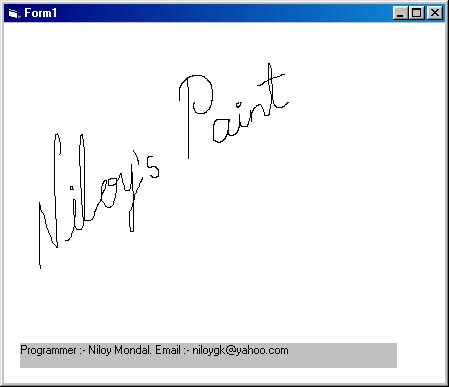

## ^A 26 Line Basic Paint Program^

### Description

This show how to make a free-hand drawing program. It is the very basic (just 26 lines).
 
### More Info
 

             |
---                |---
**Submitted On**   |2002-08-25 18:14:10
**By**             |[Niloy Mondal](https://github.com/Planet-Source-Code/PSCIndex/blob/master/ByAuthor/niloy-mondal.md)
**Level**          |Beginner
**User Rating**    |4.7 (33 globes from 7 users)
**Compatibility**  |VB 6\.0
**Category**       |[Graphics](https://github.com/Planet-Source-Code/PSCIndex/blob/master/ByCategory/graphics__1-46.md)
**World**          |[Visual Basic](https://github.com/Planet-Source-Code/PSCIndex/blob/master/ByWorld/visual-basic.md)
**Archive File**   |[^A\_26\_Line1189138162002\.zip](https://github.com/Planet-Source-Code/niloy-mondal-a-26-line-basic-paint-program__1-38009/archive/master.zip)

